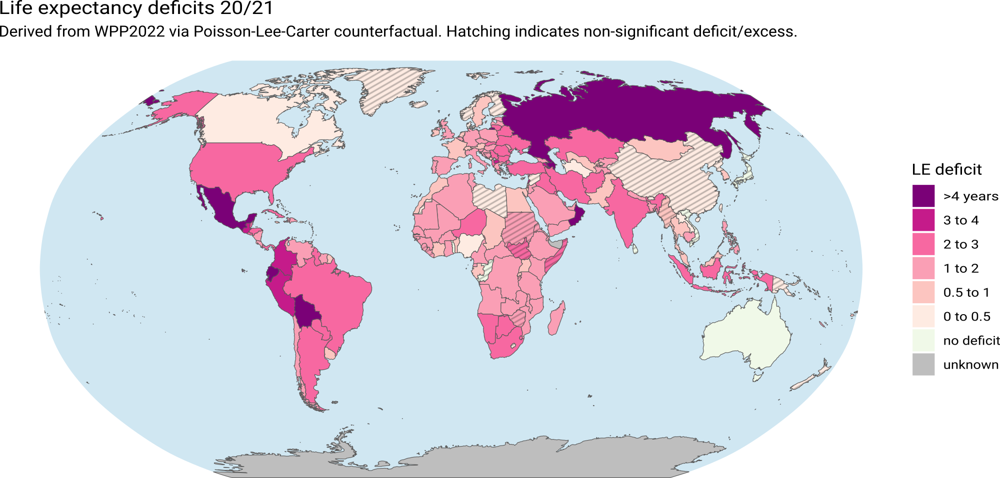

# Global life expectancy deficits 20/21 based on WPP data

Jonas Schöley

Calculate global life expectancy deficits 2020/21 based on World Population Prospects 2022 data on deaths and population. These are estimates based on incomplete and uncertain data and may only act as a rough sanity check for other modeling tasks.

## Data desciption

### Input data

- `dat/11-death_wpp.rds`

  - Death counts by region, year, sex and age via UN World Population Prospects 2022
  - https://population.un.org/wpp/Download/Files/1_Indicators%20(Standard)/CSV_FILES/WPP2022_DeathsBySingleAgeSex_Medium_1950-2021.zip

- `dat/12-exposure_wpp.rds`

  - Person-years population exposure by region, year, sex and age via UN World Population Prospects 2022
  - https://population.un.org/wpp/Download/Files/1_Indicators%20(Standard)/CSV_FILES/WPP2022_PopulationExposureBySingleAgeSex_Medium_1950-2021.zip

- `dat/coverage.rds`

  - Covid cases and deaths by region, sex, and age via COVerAGE-DB (internal file)
  - https://www.coverage-db.org/

### Output data

- `out/41-lifetablesglobal.rds`

  - **id**: Row ID <Countrycode-Sex-Year-Age>
  - **region**: Two letter ISO 3166-1 alpha-2 country code
  - **sex**: Male/Female
  - **year**: Gregorian year
  - **age_start**: Start of age group in years
  - **age_width**: Width of age group in years
  - **death_actual_wpp**: Actual number of deaths from WPP (may be observed or estimated)
  - **exposure_actual_wpp**: Actual population exposure from WPP (mid year estimates)
  - **c19cases_coverage**: Covid-19 cases via COVerAGE-DB
  - **c19deaths_coverage**: Covid-19 deaths via COVerAGE-DB
  - **mx_actual_wpp**: Life table death rate estimates calculated from WPP data
  - **mx_expected_wpp_mean**: Expected life table death rate estimates calculated from WPP data (mean prediction)
  - **mx_expected_wpp_q05**: Expected life table death rate estimates calculated from WPP data (5% prediction interval)
  - **mx_expected_wpp_q95**: Expected life table death rate estimates calculated from WPP data (95% prediction interval)
  - **ex_actual_wpp**: Life expectancy estimates calculated from WPP data
  - **ex_expected_wpp_mean**: Expected life table death rate estimates calculated from WPP data (mean prediction)
  - **ex_expected_wpp_q05**: Expected life table death rate estimates calculated from WPP data (5% prediction interval)
  - **ex_expected_wpp_q95**: Expected life table death rate estimates calculated from WPP data (95% prediction interval)
